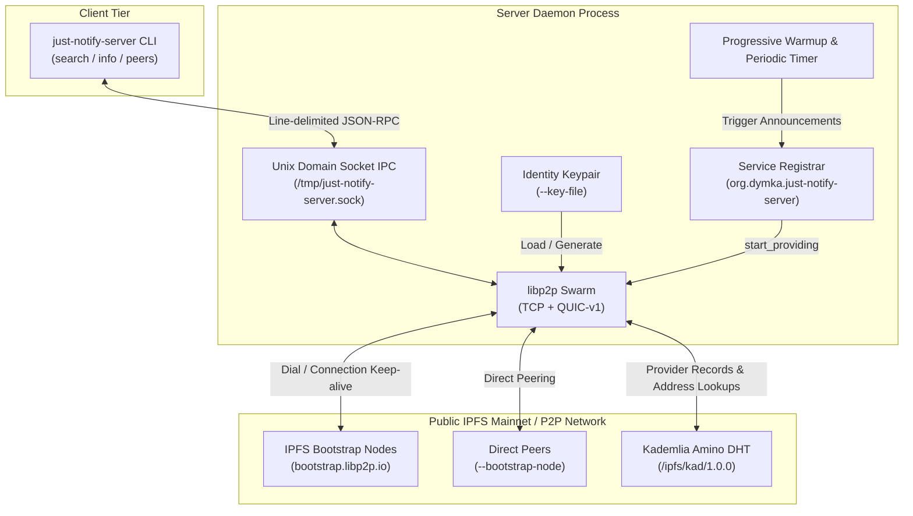
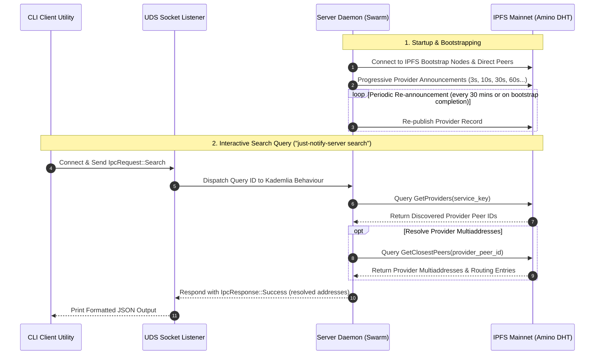

# just-notify-server

An IPFS-compatible libp2p server daemon and CLI control utility written in Rust.

`just-notify-server` connects directly to the public IPFS mainnet (Amino DHT), automatically registers its service
(`"org.dymka.just-notify-server"`) as an IPFS provider record, periodically re-announces provider records to keep DHT
routing tables fresh, dynamically resolves discovered provider multiaddresses, and exposes a Unix Domain Socket (UDS)
IPC interface for CLI inspection and queries.

## Features

- 🌐 **IPFS Mainnet Bootstrap**: Automatically connects to official IPFS bootstrap nodes (`bootstrap.libp2p.io`).
- ⚡ **Dual Transports**: Supports both **TCP** (Noise encryption + Yamux stream multiplexing) and **QUIC-v1** (UDP).
- 🏷️ **Automatic Service Registration**: Computes a deterministic SHA-256 multihash/CID for
  `"org.dymka.just-notify-server"` on startup and registers as a DHT provider.
- 🔄 **Progressive & Periodic Re-announcements**: Warmup schedule (3s, 10s, 30s, 60s, 120s) ensures immediate publishing
  as routing tables populate, with periodic re-announcements and re-publishing upon bootstrap completion.
- 🎯 **Dynamic Provider Address Resolution**: Resolves multiaddresses and IP addresses for discovered DHT providers via
  `get_closest_peers` walks and `Identify` protocol events.
- 🛡️ **Address Normalization & Quorum Consensus**: Normalizes observed external addresses to match actual listening ports
  (`tcp_port`, `quic_port`), filters non-routable private/bogon IPs, and requires quorum verification across distinct peers
  with bounded memory management before advertising public external addresses.
- 🔑 **Persistent Node Identity**: Supports `--key-file` to save and load ed25519 identity keypairs across restarts,
  avoiding orphan provider records on the DHT.
- 🔗 **Direct Peering & Custom Bootstrap**: Supports `--bootstrap-node` for direct multi-node peering on local networks
  or staging environments.
- 🔌 **Unix Domain Socket IPC**: High-performance local control socket (`/tmp/just-notify-server.sock`) using framed
  JSON-RPC.
- 📊 **Structured Event Tracing**: Granular event logging via `tracing` (swarm lifecycle, DHT query progress, Identify
  protocol details).
- 🛠️ **CLI Control Tool**: Simple command-line interface to launch the daemon or query running instances (`info`,
  `peers`, `search`).

## Architecture Overview



### Component Sequence Flow



## Prerequisites

- **Rust**: 1.75+ (2021 Edition)
- Standard development tools (`cargo`, `cc`, `git`)

## Quickstart

### 1. Build the Binary

```bash
cargo build --release
```

The compiled binary will be placed at `./target/release/just-notify-server`.

### 2. Run the Server Daemon

Start the daemon in server mode. It will listen on P2P ports (TCP `4001` & QUIC UDP `4001`) and create the IPC control
socket at `/tmp/just-notify-server.sock`:

```bash
cargo run -- daemon
```

#### Custom Daemon Options

```bash
./target/release/just-notify-server daemon \
  --tcp-port 4001 \
  --quic-port 4001 \
  --socket-path /tmp/just-notify-server.sock \
  --key-file /tmp/node1.key \
  --bootstrap-nodes-file bootstrap_nodes.txt \
  --bootstrap-node /ip4/192.168.1.50/tcp/4001/p2p/12D3KooW... \
  --service-name org.dymka.just-notify-server \
  --reannounce-interval 1800 \
  --log-level info
```

### 3. Use the CLI Client

While the daemon is running, open another terminal to query and command the server:

#### Check Server Identity & DHT Routing Table Stats

```bash
cargo run -- info
```

**Output**:
```json
{
  "connected_peers_count": 12,
  "listen_addresses": [
    "/ip4/127.0.0.1/tcp/4001",
    "/ip4/192.168.50.156/tcp/4001",
    "/ip4/127.0.0.1/udp/4001/quic-v1",
    "/ip4/192.168.50.156/udp/4001/quic-v1"
  ],
  "external_addresses": [
    "/ip4/136.169.50.80/tcp/4001",
    "/ip4/136.169.50.80/udp/4001/quic-v1"
  ],
  "peer_id": "12D3KooWQycFDbBXXu598U7pQPzpSmmvcG6TuGVLRLSrck6Bdnhr",
  "routing_table_entries": 48
}
```

#### List Connected P2P Peers

```bash
cargo run -- peers
```

**Output**:
```json
{
  "peers": [
    {
      "peer_id": "QmQCU2EcMqAqQPR2i9bChDtGNJchTbq5TbXJJ16u19uLTa",
      "ip_addresses": [
        "ny5.bootstrap.libp2p.io"
      ],
      "addresses": [
        "/dns4/ny5.bootstrap.libp2p.io/tcp/4001"
      ]
    }
  ]
}
```

#### Search IPFS Mainnet DHT for Service Providers

By default, searches for providers of `"org.dymka.just-notify-server"` (default timeout: 30s):

```bash
cargo run -- search
```

Or specify a custom service name/CID and search timeout:

```bash
cargo run -- search org.dymka.just-notify-server --timeout 45
```

**Output**:
```json
{
  "cid": "bafkreic62cvyvkn5knp2gujymlpzd3y4brmdqlw42n52lt522an2xapsne",
  "providers": [
    {
      "peer_id": "12D3KooWQycFDbBXXu598U7pQPzpSmmvcG6TuGVLRLSrck6Bdnhr",
      "addresses": [
        "/ip4/192.168.50.156/tcp/4001",
        "/ip4/192.168.50.156/udp/4001/quic-v1"
      ]
    },
    {
      "peer_id": "12D3KooWStqA3zJ6v9hL65e2aMN7u9o1b8R7K8qPx1u5g9sV3zK",
      "addresses": [
        "/ip4/192.168.50.157/tcp/4002",
        "/ip4/192.168.50.157/udp/4002/quic-v1"
      ]
    }
  ],
  "service": "org.dymka.just-notify-server"
}
```

---

## Multi-Node Local Testing

To run two independent nodes on the same host and have them discover each other:

### Start Node 1

```bash
cargo run -- daemon \
  --tcp-port 4001 \
  --quic-port 4001 \
  --socket-path /tmp/just-notify-server-1.sock \
  --key-file /tmp/node1.key
```
Note the printed Peer ID in the log (e.g. `12D3KooWNode1...`).

### Start Node 2 (Peered to Node 1)

```bash
cargo run -- daemon \
  --tcp-port 4002 \
  --quic-port 4002 \
  --socket-path /tmp/just-notify-server-2.sock \
  --key-file /tmp/node2.key \
  --bootstrap-node /ip4/127.0.0.1/tcp/4001/p2p/<NODE_1_PEER_ID>
```

### Search from Node 1 or Node 2

```bash
cargo run -- search org.dymka.just-notify-server --socket-path /tmp/just-notify-server-1.sock
```

Both Node 1 and Node 2 will be immediately resolved with their respective multiaddresses.

---

## Testing & Quality Assurance

### Run Unit Tests

```bash
cargo test --bin just-notify-server
```

### Run Formatting & Lints

```bash
# Check code formatting
cargo fmt --check

# Run Clippy static analysis
cargo clippy -- -D warnings
```
