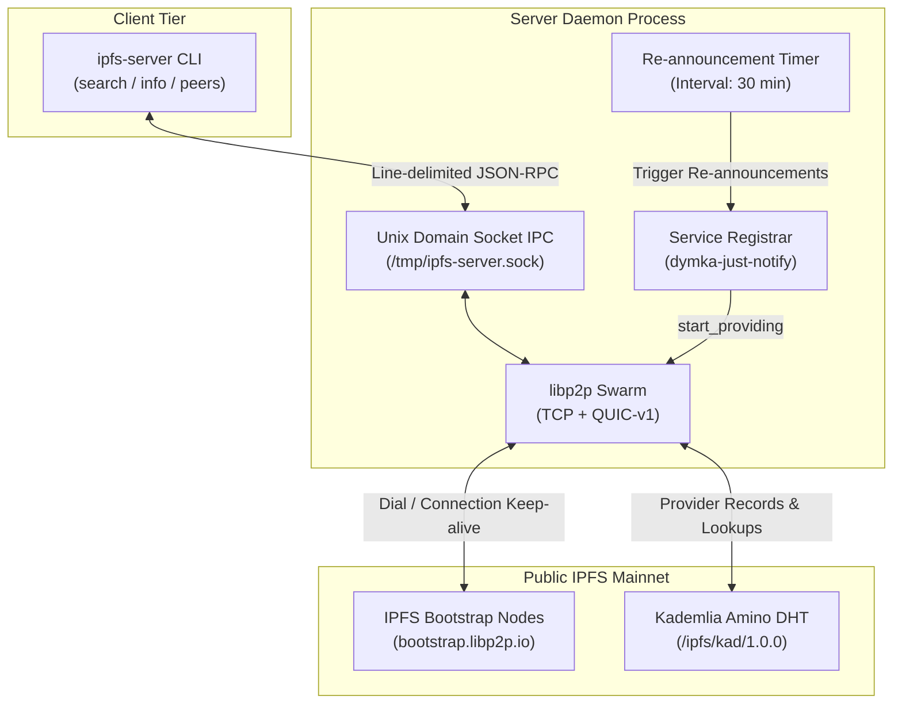
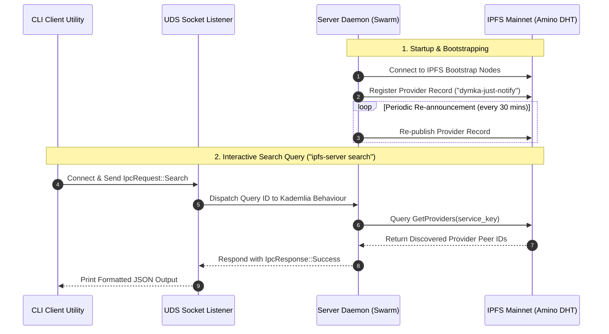

# ipfs-server

An IPFS-compatible libp2p server daemon and CLI control utility written in Rust.

`ipfs-server` connects directly to the public IPFS mainnet (Amino DHT), automatically registers its service (`"dymka-just-notify"`) as an IPFS provider record, periodically re-announces provider records to keep DHT routing tables fresh, and exposes a Unix Domain Socket (UDS) IPC interface for CLI inspection and queries.

## Features

- 🌐 **IPFS Mainnet Bootstrap**: Automatically connects to official IPFS bootstrap nodes (`bootstrap.libp2p.io`).
- ⚡ **Dual Transports**: Supports both **TCP** (Noise encryption + Yamux stream multiplexing) and **QUIC-v1** (UDP).
- 🏷️ **Automatic Service Registration**: Computes a deterministic SHA-256 multihash/CID for `"dymka-just-notify"` on startup and registers as a DHT provider.
- 🔄 **Periodic Re-announcements**: Background timer periodically re-publishes provider records to maintain active DHT presence.
- 🔌 **Unix Domain Socket IPC**: High-performance local control socket (`/tmp/ipfs-server.sock`) using framed JSON-RPC.
- 📊 **Structured Event Tracing**: Granular event logging via `tracing` (swarm lifecycle, DHT query progress, Identify protocol details).
- 🛠️ **CLI Control Tool**: Simple command-line interface to launch the daemon or query running instances (`info`, `peers`, `search`).

## Architecture Overview



### Component Sequence Flow




## Prerequisites

- **Rust**: 1.75+ (2021 Edition)
- Standard development tools (`cargo`, `cc`, `git`)


## Quickstart

### 1. Build the Binary

```bash
cargo build --release
```

The compiled binary will be placed at `./target/release/ipfs-server`.

### 2. Run the Server Daemon

Start the daemon in server mode. It will listen on P2P ports (TCP `4001` & QUIC UDP `4001`) and create the IPC control socket at `/tmp/ipfs-server.sock`:

```bash
cargo run -- daemon
```

Or using the release binary:

```bash
./target/release/ipfs-server daemon
```

#### Custom Daemon Options

```bash
./target/release/ipfs-server daemon \
  --tcp-port 4001 \
  --quic-port 4001 \
  --socket-path /tmp/ipfs-server.sock \
  --bootstrap-nodes-file bootstrap_nodes.txt \
  --service-name dymka-just-notify \
  --reannounce-interval 1800 \
  --log-level info
```

### 3. Use the CLI Client

While the daemon is running, open another terminal to query and command the server:

#### Check Server Identity & DHT Routing Table Stats

```bash
cargo run -- info
```

**Output**:
```json
{
  "connected_peers_count": 12,
  "listen_addresses": [
    "/ip4/127.0.0.1/tcp/4001",
    "/ip4/192.168.50.156/tcp/4001",
    "/ip4/127.0.0.1/udp/4001/quic-v1",
    "/ip4/192.168.50.156/udp/4001/quic-v1"
  ],
  "peer_id": "12D3KooWQycFDbBXXu598U7pQPzpSmmvcG6TuGVLRLSrck6Bdnhr",
  "routing_table_entries": 48
}
```

#### List Connected P2P Peers

```bash
cargo run -- peers
```

#### Search IPFS Mainnet DHT for Service Providers

By default, searches for providers of `"dymka-just-notify"`:

```bash
cargo run -- search
```

Or specify a custom service name or CID string:

```bash
cargo run -- search dymka-just-notify
```

**Output**:
```json
{
  "cid": "bafkreibjxsnlwqya5jwmorqbygtlwozk6rc4ociq6swm7u7jkzch7j3lxm",
  "providers": [
    "12D3KooWQycFDbBXXu598U7pQPzpSmmvcG6TuGVLRLSrck6Bdnhr"
  ],
  "service": "dymka-just-notify"
}
```

## Testing & Quality Assurance

### Run Unit Tests

```bash
cargo test
```

### Run Formatting & Lints

```bash
# Check code formatting
cargo fmt --check

# Run Clippy static analysis
cargo clippy -- -D warnings
```
